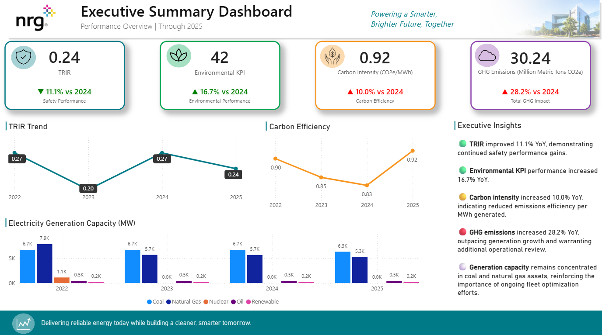

# NRG ESG Executive Dashboard
## Overview

This project demonstrates the design and development of an executive-level ESG dashboard using publicly available sustainability data from NRG Energy's 2025 ESG reporting.

The dashboard was designed to move beyond descriptive reporting and provide decision-support insights for leadership teams responsible for safety, environmental performance, and operational excellence.

The project focuses on presenting complex ESG information in a format that is easy to consume and actionable for executives.

## Business Problem

Energy companies manage large volumes of safety, environmental, and operational data across multiple systems and business units.

Leadership teams require concise, high-value reporting that helps answer questions such as:

- Are safety outcomes improving?
- Are environmental targets being met?
- Are emissions increasing faster than production growth?
- Where should management focus improvement efforts?

Traditional ESG reports often provide historical information but limited decision support.

This dashboard was designed to bridge that gap.

## Dashboard Preview

### Live Interactive Dashboard

Explore the fully interactive Power BI dashboard here:

[View Interactive Dashboard](https://app.powerbi.com/view?r=eyJrIjoiYWU5ZDU1MmItYTUwMy00YWYzLTg4MDktYWMyOTgyODcxOGVmIiwidCI6IjQzYTQ3YmQxLWI1MmQtNDZkMy05NmI3LTQwOTk0ZTI5YjAyNyJ9)

## Dashboard Features

### Executive KPI Summary
- Total Recordable Incident Rate (TRIR)
- Environmental KPI Performance
- Carbon Intensity (CO2e/MWh)
- Total Greenhouse Gas Emissions

### Trend Analysis
- Multi-year TRIR performance trends
- Carbon efficiency trends

### Generation Portfolio Analysis
- Electricity generation mix by fuel source
- Coal, natural gas, nuclear, oil, and renewable generation comparisons

### Executive Insights
- Automatically generated business observations
- Identification of emerging risks and opportunities
- Recommended leadership focus areas

## Tools Used

- Power BI Desktop
- DAX
- Power Query
- Microsoft Excel
- GitHub

  ## Skills Demonstrated

- Data Modeling
- DAX Measure Development
- KPI Design
- Executive Dashboard Development
- Data Storytelling
- Business Intelligence
- ESG Analytics
- Data Visualization
- Trend Analysis
- Decision Support Analytics

## Example Insights

The dashboard identified several notable trends within the 2025 ESG data:

- TRIR improved by 11.1% compared to 2024.
- Environmental KPI performance improved by 16.7%.
- Carbon intensity increased by 10.0%, indicating reduced emissions efficiency per MWh generated.
- Total greenhouse gas emissions increased by 28.2%, outpacing generation growth.
- Generation capacity remained heavily concentrated in coal and natural gas assets.

## Future Enhancements

- Integration with live ESG reporting systems
- Automated refresh pipelines
- Drill-through analysis by business unit or generating asset
- Predictive analytics for emissions forecasting
- AI-generated executive commentary

## Data Source

This project uses publicly available ESG data published by NRG Energy as part of its 2025 sustainability reporting.

- [NRG Sustainability Reporting Portal](https://www.nrg.com/sustainability/reporting.html)

The analysis is based specifically on the **2025 ESG Data Download** available through the reporting portal.

This project was created for educational and portfolio purposes and is not affiliated with, endorsed by, or sponsored by NRG Energy.
